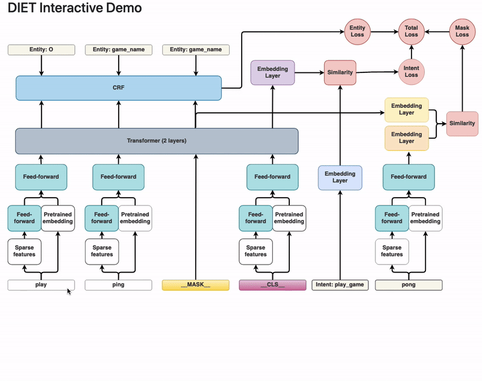
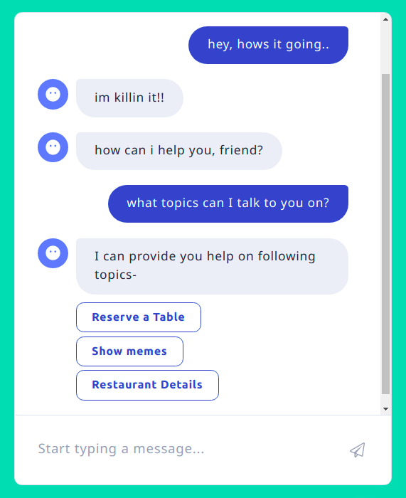
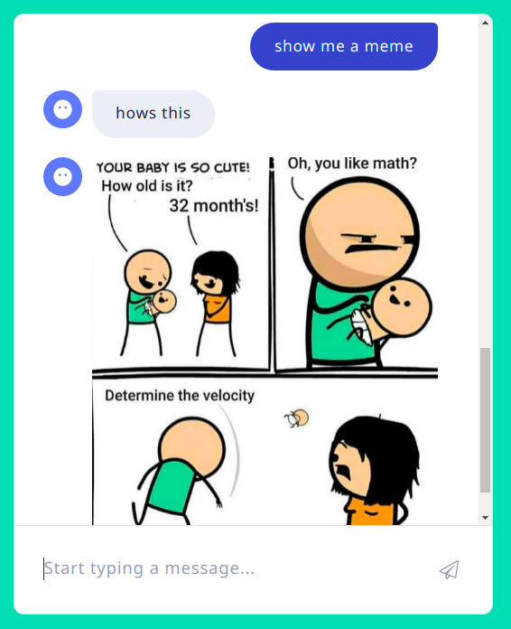
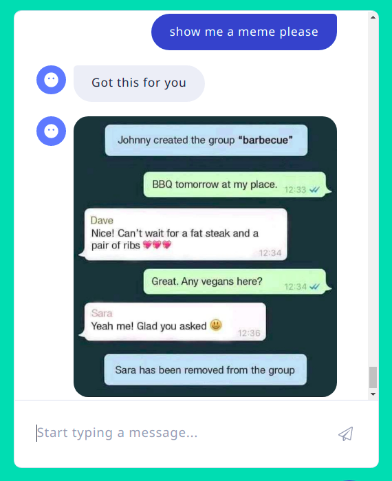
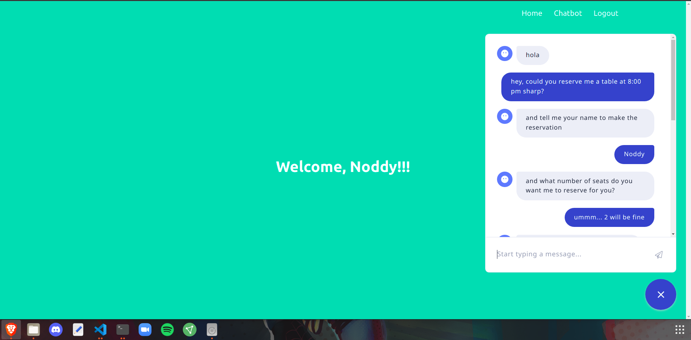
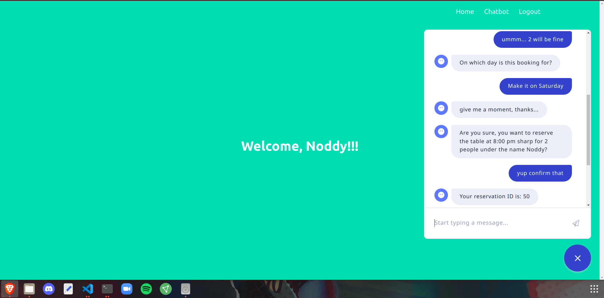
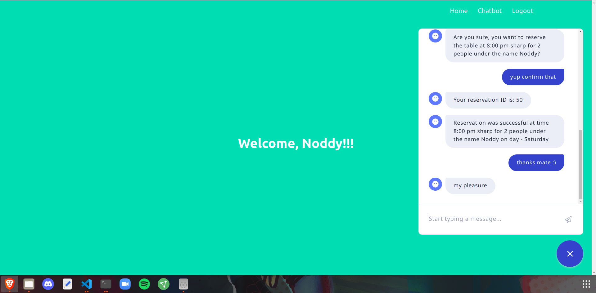

# Domain-Specific-Chatbot

## Inroduction
This project is about a Domain Specific Chatbot for booking restaurant reservation. It uses a DIET (Duel Intent and Entity Transformer) classifier. More about [DIET classifier](https://rasa.com/blog/introducing-dual-intent-and-entity-transformer-diet-state-of-the-art-performance-on-a-lightweight-architecture/) in rasa documentation.
<p float="left">
    
</p>

## Interface and conversations with chatbot

### 1. Normal conversation
<p float="left">
    
</p>

### 2. Show memes
<p float="left">
    
</p>
<p float="right">
    
</p>

### 3. Make reservation
<p float="left">
    
</p>
<p float="right">
    
</p>
<p float="right">
    
</p>

## How to use
### 1. Cloning and installing dependancies
```sh
git clone https://github.com/chinmay-d/Domain-Specific-Chatbot.git

pip install -r requirements.txt
```

**NOTE:**  You can skip the below step if you dont want to show memes

### 2. Setting up a ngrok tunnel to host memes
Download and set [ngrok](https://ngrok.com/download)
host meme folder like this:
```sh
ngrok http file://< PATH TO MEMES FOLDER >
```
change the image path to ngrok's hosted path in `domain.yml`

### 3. Run rasa server
```sh
rasa run -m models --enable-api --cors "*"
```

### 4. Run actions.py
```sh
python -m rasa_sdk --actions actions
```

### 5. Run flask webapp
```sh
export FLASK_APP=restaurant_webapp
export FLASK_DEBUG=1
export FLASK_ENV=development

flask run --no-reloads
```

## Licence
This project is totally free to use, although credit would be appreciated in case of any reuse of the work.
